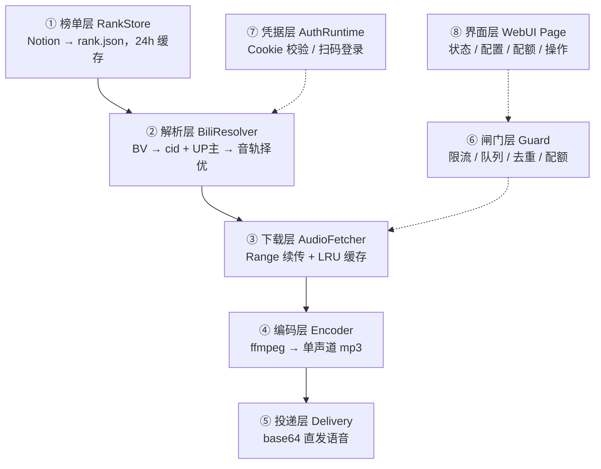

## 写在前面

群里聊天想随手点一首哈基米音乐，没有顺手的工具。这个圈子有个整合站 [hajihami.com](https://hajihami.com)，把 B站 上的作品整理成了播放量总榜，但只有网页版，想分享还是得自己复制链接。

于是在 AI 辅助下自己写了一个：群里发一句 `/哈基米`，机器人从榜单里随机挑一首，转码后以语音消息发回群里。

::github{repo="YoinSama/astrbot_plugin_hachimitsu_music"}

前半部分是开发复盘，后半部分是安装使用说明，只想装插件可以直接跳到 [第二部分](#第二部分安装与使用)。


---

## 第一部分：开发复盘

### 一、先搞清楚数据从哪来

动手前先花了一轮把数据源摸清楚。

**榜单是一个 Notion 数据库。** 站点 `hajihami.com` 是 Notion 公开站点套壳，服务端给 HTML 框架，正文全靠 JS 加载。首页 DOM 里只嵌了 6 个示例播放器，完整榜单在数据库视图里，所以得走接口。

用 Notion 的非公开 API 能拿到数据：13,198 条记录，含 BV 号、播放量、作者、风格等 14 个字段。

**B站 音频可以匿名拿。** 关键在 DASH 接口：只要一个 `buvid3` cookie，不用登录 SESSDATA。等距抽样 30 条（覆盖榜首到第 3000 名），平均单条 2.35 MB、时长 117 秒。非会员能拿到的最高音轨是 192K，Hi-Res 无损和杜比都要大会员。

### 二、一次方向调整：从"全量下载"到"按需点播"

最早写的技术方案是个**批量下载工具**，把榜单上的音频一股脑下到本地存档。方案都写完了，算出来全量约 30 GB。

然后发现方向错了：要的不是离线曲库，是群里有人想听时能立刻放一首。

输出层整个换掉，前三层（榜单层、解析层、下载层）原样保留，第四层从落盘归档改成 AstrBot 发送层。改完连带着换了一批问题：并发、限流、队列和语音格式兼容性。

### 三、插件的分层

插件拆成八层，单向依赖，每层可以单独测：



闸门层和凭据层是横切的，界面层只做展示和操作。实现都放在 `core/` 下，`main.py` 只负责注册指令和 Web 接口。

### 四、踩过的坑

#### 1. multi_select 不 split，风格池会静默归零

榜单里的「风格」字段是 Notion 的 multi_select 类型，原始值形状是 `[["标签1,标签2,标签3"]]`，取出来是用英文逗号拼起来的一整串，必须再 `split(",")` 才能拿到独立标签。

我一开始就漏了这一步。结果是五个风格池里**四个被解析成 0 首**，随机取歌每次静默回退到总榜，五分类等于没做，而且不报错，日志也看不出来。

对策是加了一条**启动自检基线**，把各标签的期望数量打进启动日志：

```
现代主义 ≈ 842   原教旨主义 ≈ 606   翻唱 ≈ 461   AI小马 ≈ 422
曼波好听～ ≈ 343  冰🧊！ ≈ 234      婉约派 ≈ 82   哈基周金曲 ≈ 25
```

任何本该有数据的标签出现 0，就是解析出问题了。这种失败时不吭声的 bug，只能靠主动埋检测点。

#### 2. 全角和半角

自定义风格池时我写的是「曼波好听~」「冰🧊!」，字段实际值是「曼波好听**～**」(U+FF5E)「冰🧊**！**」(U+FF01)。肉眼完全看不出来，代码里是两个不同的字符串。

后来把这些常量写死在代码里，不放配置项，省得再手误。

#### 3. 异常发生在降级之前，降级链根本没机会执行

音质这块设计了三级降级：拿不到无损就退回杜比，再退回 192K。看着很稳，实测点了歌直接失败。

原因在这里：两个异常都发生在音轨择优的内部，而降级是择优之后的逻辑。异常在择优里抛出，降级压根没机会执行。

具体是这两个：

- 未登录时 `data["vipStatus"]` 字段不存在 → KeyError
- `dolby.audio` 为 null 时对它取 `max()` → TypeError

改成 `.get()` 和 `or []` 之后，外面再套一层 try/except 兜底：万一还有没想到的情况，至少退回最高可用音轨，不让整次点歌失败。

#### 4. 事件循环不能被堵住

AstrBot 是单事件循环框架，任何同步阻塞都会让 bot 对所有群、所有用户失去响应。

第一个踩到的是 ffmpeg：转码用的是 `subprocess.run`，直接调用会阻塞，必须扔进线程池：

```python
proc = await asyncio.to_thread(_run_ffmpeg, cmd)
```

第二个是存储选型的连锁反应。榜单有一万三千条，我一度想换成 SQLite，实测四种方案后放弃了：

| 维度 | JSON + 内存索引（采用） | SQLite 查询时查 |
|---|---|---|
| 随机取歌 | **0.0017 ms** | 0.0794 ms（慢 47 倍） |
| 关键词搜索 | 0.7084 ms | 0.0455 ms（快 15.6 倍） |
| 冷启动 | 77.8 ms | 39.6 ms（但建库另算） |
| 是否阻塞事件循环 | 不阻塞 | **同步阻塞**，每次要 `to_thread` |

SQLite 搜索快 15 倍，随机取歌慢 47 倍，而随机取歌是每次点歌必走的路径；更硬的一条是 SQLite 同步阻塞，每次查询都要抢占线程池，ffmpeg 转码也在用同一个线程池。

搜索慢的那 0.7 ms 放在一次点歌 1~2 秒里，可以忽略。

> [!NOTE]
> 什么时候才该换 SQLite：榜单涨到 10 万行以上、需要复杂条件查询、或者需要增量更新而不是每天全量替换。现在三条都不满足。

#### 5. 语音消息怎么发

这条涉及三方的行为差异：AstrBot 组件、协议端、QQ 客户端。

**不能用 `Comp.Record` 发语音。** 它内部会强制转成 WAV：一首 133 秒的歌变成 23 MB，base64 之后 31 MB，WebSocket 直接超时。

**也不能用 `file://` 路径。** 跨容器部署时协议端看不到宿主的真实路径，会报 `realpath ENOENT`。

最后用的是 **base64 直发 record 段**，降级链也明确了：`base64 record` → `Comp.Record`（仅兜底）→ 只发文字信息。

还有一件事没自己造：协议端（SnowLuma / NapCat）会自动把音频转成 silk 上传。自己提前转一个非标准 silk，手机端播不了，时长还会被钳到 1 秒，所以交给协议端处理。

#### 6. 两个"点了没反应"的按钮

控制台问题：保存配置没反应，重置全部点了没动静。查下去是两个完全独立的原因。

**其一，提示条滚出屏幕了。** toast 是 `position: static`，挂在文档顶部。在下方卡片里点按钮时，它的实测 `top` 是 **-620**，在视口外。提示真的弹了，只是看不见。改成 `sticky` 吸顶跟随滚动，再给所有按钮套一层统一包装器：防连点，异常必弹提示。

**其二， iframe 里的 `confirm()` 直接返回 false。

AstrBot 的插件页面跑在 iframe 里，没给 `allow-modals`，浏览器会直接忽略原生弹窗，并且把 `confirm()` 当作取消。而重置全部和清空缓存两个函数的第一句就是 `if (!confirm(...)) return;`，于是彻底失效，连个提示都没有。

解法是自己画一个页面内确认面板，返回 Promise，用法和 `confirm` 一致，不依赖任何浏览器弹窗权限：Esc 取消、点遮罩取消、焦点默认落在取消按钮上，防手滑连按回车。

### 五、拿数据做决定

这个项目里大部分决策是实测出来的，不是拍脑袋。举几个例子。

**榜单刷新频率**，页面上有个视图叫"每分钟刷新显示随机音乐"，看着像数据在每分钟变。实测下来，轮换的是展示顺序（按一个随机公式字段排序），数据库行本身 2 小时才增加 20 行。

| 方案 | 请求量 | 结论 |
|---|---|---|
| 每次随机到风格池就请求一次 | ~100 次/天 | 没必要 |
| 每分钟全量刷新对齐网页 | 8,640 次/天 | 直接排除 |
| **全量缓存 + 本地按风格筛** | **6 次/天** | 采用 |

顺带测出来：132 次小请求连发会触发 Notion 连接重置（`Errno 10053`），3000 条一个大批量请求正常。所以请求数要压到最少，多线程猛发反而更容易被掐。

**权重设计**，总榜和五个风格池按权重加权一次选出，默认总榜 50、每个风格池 10。跑了 20 万次采样验证分布：总榜 50.0%、五个池各 10.0%。

**发送音质档位**，同一首 133 秒的作品，三档实测：

| 档位 | 参数 | 文件体积 | base64 载荷 |
|---|---|---|---|
| 高 | 44.1kHz / 128k | 2.12 MB | 2.83 MB |
| **标准（默认）** | 24kHz / 64k | **1.06 MB** | 1.41 MB |
| 省流 | 16kHz / 32k | 0.53 MB | 0.71 MB |

默认选标准，是因为语音消息在 QQ 里还要被转一次 silk，三档听感差距比数字看起来更小，体积差 4 倍。

**重复 BV 不去重**，13,217 行里有 79 个重复 BV。早先做离线下载时按 BV 去重是为了省带宽，按需点播没这个问题。重复会让那首歌被抽中的概率略高，无害，去掉反而丢失榜单原始信息。只在启动日志里记一行。

### 六、部署：意外的好消息

插件依赖只有 `httpx` 和 `qrcode` 两个包。在干净 venv 里装了一遍，连带传递依赖一共 10 个包、约 7.5 MB。然后用 AstrBot 自己的解释器逐个探测，发现**这 10 个包在 AstrBot 4.28.0 里已经全部存在**（它自己的 WebUI 和图片处理就要用这些）。

所以最终安装是零额外依赖：复制目录并重启。

部署后的接口验证：榜单缓存拉到 1.9 MB / 13,217 行，五个风格池的数字（343 / 234 / 25 / 606 / 82）与实测基线逐一对上，Notion 解析、内存索引、Web API 三层都对。

---

## 第二部分：安装与使用

### 安装

两种方式，都在 AstrBot 的「插件」页面操作：

1. **从文件安装**：从仓库下载 Zip 包 → 「安装插件」→「从文件安装」→ 选择 Zip
2. **从链接安装**：复制 `https://github.com/YoinSama/astrbot_plugin_hachimitsu_music.git` → 「从链接安装」→ 粘贴

装完点**重载插件**生效。首次启动会从 Notion 全量拉取榜单，约 10 秒，之后按配置的周期自动刷新。

要求：AstrBot ≥ 4.27.2，协议端用 OneBot v11（推荐 [SnowLuma](https://github.com/SnowLuma/SnowLuma)，NapCat 未测试）。ffmpeg 可选，没装的话回退原始 m4a 直发，音质一致、体积略大。

### 指令

| 指令 | 行为 | 权限 |
|---|---|---|
| `/哈基米` | 随机来一首（总榜 50% + 五个风格池各 10%） | 所有人 |
| `/哈基米 <关键词>` | 模糊搜索前 5 条，回复序号点播 | 所有人 |
| `/哈基米 帮助` | 用法说明 | 所有人 |
| `/哈基米 状态` | 运行状态 | 管理员 |
| `/哈基米状态` | 同上（独立入口，便于在指令管理页单独启停） | 管理员 |

发出的消息长这样：

```
《曼波の小曲》《登山の小曲》La La La（孤高曼波）
作者：手柄推荐2026
https://www.bilibili.com/video/BV1FMefeGEKU
[语音消息 —— 整首]
```

搜索结果按播放量降序，不展示播放量，60 秒内回复序号或「取消」。

### 几个值得留意的配置

**音质**，`audio_quality` 是从 B站 下载哪条源音轨（`192k` / `132k` / `64k` / `flac`），`vocal_preset` 是发给 QQ 的编码档位（`high` / `standard` / `lite`）。选 `flac` 需要配了带大会员的 Cookie，否则自动降级到 192K。

**限流**，用户冷却 30 秒、群冷却 10 秒、用户每天 20 首、群每天 100 首、全局每分钟 10 首、并发 2、队列 20。所有拦截都会明确回复原因和剩余等待秒数，不静默丢弃。

> [!WARNING]
> **要关掉某项限制请填 `-1`，不要填 0。** 填 0 会被当成无效值自动改成 1，比如 `max_concurrency=0` 会让插件直接卡死且没有任何报错。被自动纠正时，启动日志和网页控制台都会提示。

**时长限制**，默认跳过 10 分钟以上的作品（实测约占 4.2%，最长的一首有 43 分钟）。随机点歌抽到太长的会自动换一首，用户全程无感；已失效的稿件（约 1.7%）一并跳过。判定用的是 `view` 接口白送的 `duration` 字段，不额外发请求。

**B站 账号（可选）**，不填 Cookie 也能正常用，音质上限 192K。Cookie 失效时插件会私聊管理员请求确认，回复「确定」后本地渲染登录二维码（token 不交给任何第三方），扫码成功自动落盘。管理员不协助也会自动回退匿名模式继续跑。

### WebUI 控制台

插件自带页面，在 AstrBot 插件详情页打开，不用额外部署：

- **运行状态**：榜单条数与更新时间、各风格池规模、Cookie 与会员状态、实际音质、熔断状态、队列、缓存占用
- **常用配置**：音质档位、随机权重、限流参数改完即时生效
- **配额管理**：可勾选的群 / 用户列表（显示群名和昵称 + 真实头像，支持按名字搜），一键重置
- **操作**：手动刷新榜单、清空音频缓存、发起扫码登录

> [!NOTE]
> 「向管理员发起登录请求」需要管理员**先私聊过一次 bot**，让插件缓存会话 id。

### 常见问题

**点了没反应 / 提示「风控熔断」**，触发了 B站 风控（`-352` / `-412` / `-799`）或处于熔断冷却期，等约 120 秒自动恢复。频繁触发的话调低 `global_per_minute` 或调大 `user_cooldown_seconds`。

**配了大会员 Cookie 还是只有 192K**，Cookie 填错、过期，或账号并非有效大会员。在控制台用「扫码登录」重新登录即可。（其实这几档音质差别很细微，个人觉得哈基米音乐带点失真才是 true music。）

**想调整风格池比例**，改 `top_weight`（总榜权重）和 `style_weight`（每风格池权重），保存后即时生效。


---

## 最后

插件目前更新到 **v1.2.1** 版本，从 9 月 14 日第一个版本到 9 月 16 日，中间迭代了四版。

还没做完的事：更多预设风格池（现在只有五个，是硬编码的常量）。

致谢：[hajihami.com](https://hajihami.com) 的整理者 `pinkillqaq` 和所有创作哈基米音乐的全民制作人；AstrBot 社区；实现过程中参考了 `astrbot_plugin_media_parser`、`astrbot_plugin_qqmusic`、`Bilibili-Evolved` 等项目的设计与经验。

> [!CAUTION]
> 榜单数据来自 hajihami 站点，作品数据源来自 bilibili。站点已明确声明**不得商用**，本项目仅供个人学习与娱乐，请勿用于任何商业用途。

插件地址：[github.com/YoinSama/astrbot_plugin_hachimitsu_music](https://github.com/YoinSama/astrbot_plugin_hachimitsu_music)
